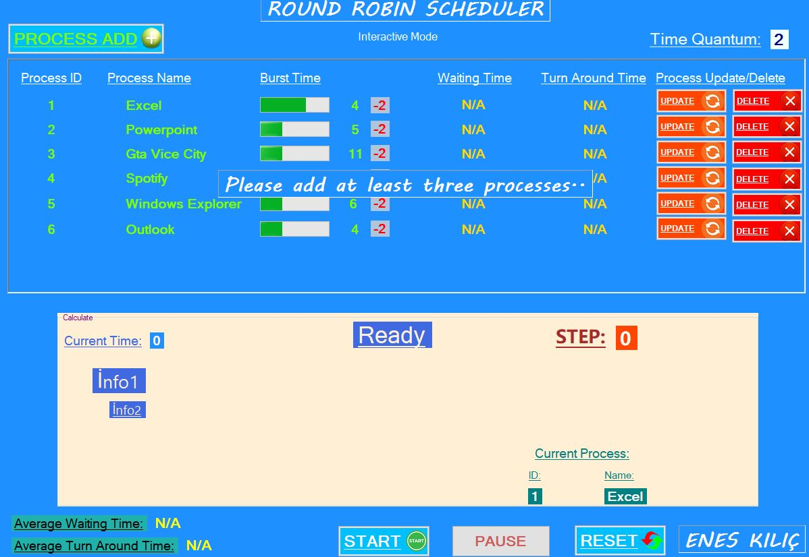

# Round Robin Scheduling Algorithm - C# Windows Form Application

  

## Project Overview

This project is a Windows Form Application developed using the .NET Framework in C# that simulates the Round Robin Scheduling Algorithm, a crucial operating system scheduling technique. The application allows processes to be managed and scheduled in both simulation and interactive modes. The system records every transaction, such as the running time, start/end times, and process durations, and stores this data in a Microsoft SQL Server database.

The Round Robin Scheduling Algorithm ensures that each process gets an equal share of CPU time in a rotating manner. This system will facilitate process management, calculate waiting times, turnaround times, and provide a comprehensive overview of each process's performance.

## Table of Contents

- [Technologies Used](#technologies-used)
- [Features](#features)
  - [Simulation Mode](#simulation-mode)
  - [Interactive Mode](#interactive-mode)
- [Algorithms](#algorithms)
  - [Process Scheduling](#process-scheduling)
  - [Round Robin Time Calculation](#round-robin-time-calculation)
- [Parameters](#parameters)
- [Database Integration](#database-integration)
- [User Interface](#user-interface)
- [How to Use](#how-to-use)
- [Resources](#resources)
- [License](#license)

## Technologies Used

- **Programming Language**: C# (.NET Framework)
- **Database Management System**: Microsoft SQL Server
- **UI Framework**: Windows Forms
- **Version Control**: Git

## Features

### Simulation Mode

- In **simulation mode**, processes are managed automatically by the system based on a random time quantum. The system will decide when to start, stop, pause, or continue the processes.
- The necessary information for each process (e.g., burst time, future time) is assigned along with process IDs and names.
- The system will change processes based on the time determined by the system.

### Interactive Mode

- In **interactive mode**, the user provides input through Windows Form UI components such as text boxes and counters to define the burst time, future time, and other parameters for each process.
- Users can create new processes, finish processes, and request I/O operations.
- The system calculates and displays the waiting time and turnaround time for each process.
- Average waiting times and turnaround times for all processes will be calculated and displayed.
  
## Algorithms

### Process Scheduling

- The Round Robin algorithm schedules processes in a rotating manner, giving each process a fixed time slice (quantum) to execute.
- Processes are handled by the CPU in turn, with each process getting an equal chance to execute.
  
### Round Robin Time Calculation

- **Burst Time**: The time it takes for each process to complete its execution.
- **Waiting Time**: The total time a process spends waiting in the ready queue before it gets executed.
- **Turnaround Time**: The total time from the submission of a process to its completion.

### Process Life Cycle

1. **Process Creation**: Processes are created with necessary data such as burst time and arrival time.
2. **Execution**: Each process is given a time quantum. If a process does not complete within the given time, it will be placed back in the queue.
3. **Completion**: Processes that complete their execution will be marked as finished, and the system will update the database.
4. **Input/Output Requests**: Users can trigger I/O operations, which pause the process and add extra time to the total execution.

## Parameters

The following parameters will be used in the Round Robin scheduling simulation and interactive modes:

- **Number of Processes**: The total number of processes to be scheduled.
- **Incoming Time of Each Process**: The time at which each process arrives for scheduling.
- **Time Quota (Quantum)**: The amount of CPU time each process will receive before the CPU switches to another process.
- **Input/Output Requests**: The number of I/O requests made by the process during its execution.

## Database Integration

- The application stores process-related data in a Microsoft SQL Server database.
- The data includes:
  - Process ID
  - Process Name
  - Burst Time
  - Arrival Time
  - Completion Time
  - Waiting Time
  - Turnaround Time
  - Any I/O request logs
- This ensures that every step, transaction, and process information is properly tracked for later analysis.

## User Interface

The user interface is built with Windows Forms to allow easy interaction. It includes:
- **Text Boxes**: For entering process data such as burst time, future time, and process names.
- **Buttons**: To start, pause, resume, and stop processes.
- **Counters/Labels**: To track time and process states.
- **Grid Views**: To display the status of all processes in real-time, including their waiting and turnaround times.

## How to Use

1. **Launch the Application**: Open the C# Windows Form Application on your machine.
2. **Select Simulation or Interactive Mode**: Choose the mode in which you want to run the algorithm.
3. **Input Process Data**: For interactive mode, enter the required process information through the provided UI components.
4. **Execute the Processes**: Start the simulation or run processes interactively. The system will automatically calculate the waiting times, turnaround times, and display the results.
5. **View Results**: After execution, you will see the results for each process, including the average waiting and turnaround times.

## Resources

- [Round-Robin Access To The ThreadPool - Net Matters](https://docs.microsoft.com/en-us/archive/msdn-magazine/2009/january/net-round-robin-access-to-the-threadpool)
- [C# Round Robin Resources](http://rizwanansari.net/c-sharp-round-robin-resources/)
- [Round Robin Implementation in C# - GitHub](https://github.com/alicommit-malp/roundrobin)

## License

This project is licensed under the MIT License - see the [LICENSE](LICENSE) file for details.
